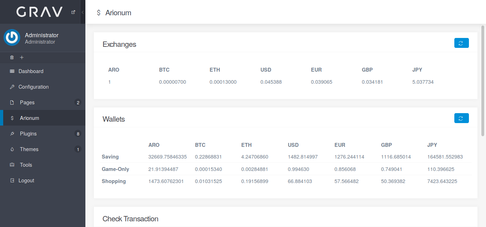

# Grav Arionum Plugin



This is plugin for [Grav CMS](http://github.com/getgrav/grav) for keeping track of balances of Arionum wallets, exchange rates and checking transaction details. This plugin is a hobby project but more features will be available.

[Arionum](https://www.arionum.com/) is a blockchain platform powered by PHP programming language.

**NOTE**: _**This plugin is not a web wallet!**_

## Requirements

 * [Admin plugin](https://github.com/getgrav/grav-plugin-admin).

## Features

* Add unlimited Arionum wallet.
* Check exchange rates between Arionum and Bitcoin (BTC), Ethereum (ETH) on [Mercatox]( https://mercatox.com/) exchange.
* Check exchange rates between Arionum and fiat currencies EUR, GBP, JPY, AUD, BRL, CAD, CHF, CLP, CNY, DKK, HKD, INR, ISK, KRW, NZD, PLN, RUB, SEK, SGD, THB, TWD via [Blockchain](https://blockchain.info/ticker) API.
* Get transactions of a wallet.
* Get detail of a transaction.

## Installation

### Via GPM

This plugin is not listed in GPM (Grav Package Manager) yet. After it is added to GPM, you can install via `Admin` plugin or via command line by running this command:

```
$ bin/gpm install arionum
```

### Manual Installation

You download the [latest release](https://github.com/tranduyhung/grav-plugin-arionum/releases), extract the archive file into your `user/plugins` folder, then ensure the folder name is `arionum`.

## Configuration

In admin area, you configure `Arionum` plugin by clicking `Plugins` on the left menu, then click `Arionum` in the list of installed plugins.

 * Give your wallet address a name and add the name and the wallet to `Wallet Addresses` option.
 * Select the currencies you want to convert your wallet's balance to in `Currencies` option.
 * Save the plugin and ensure your configuration is saved successfully.

## Usage

Click `Arionum` on the left menu in admin area and use the available tools.

## Contribution

This plugin is just a hobby project and was built pretty quickly. Please feel free to submit your improvements and features to `dev` branch.

## Donation

If you would like to send me some ARO, please send to

```
5n4x4MFi97B9jnYn7JbtnnKhrc9kzzpLEvAriB2qRypz6dhuHZjRsaAwbQp3NDPSeMv7L8GiACz5yNGx2Z3UQc9
```

Thank you!

## License

See [LICENSE](LICENSE).
